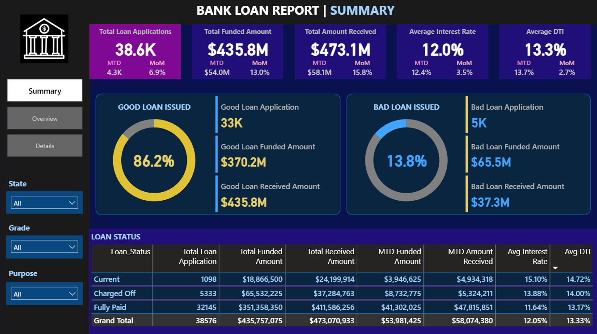

# Bank Loan Analysis

This project analyzes bank loan data to evaluate overall lending performance and borrower profiles.
It includes dashboards to track key indicators such as: 
Total loan applications, 
Funded amounts,
Amount received,
Interest rates, and
Debt-to-income (DTI) ratios. 
The insights help identify good vs. bad loans and support data-driven decision making.

### 🔍 Key Features
- KPI Summary Dashboard (MTD & MoM Comparison)
- Good Loan vs Bad Loan Portfolio Analysis
- State-wise & Purpose-wise Loan Distribution
- Borrower Employment & Home Ownership Impact Analysis
- Detailed Data Explorer Dashboard

### 📂 Project Files
| File Type | Description |
|----------|-------------|
| `.csv / .xlsx` | Original dataset used for analysis |
| `.pbix` | Power BI Dashboard file |
| `.sql` | SQL queries used for data extraction & KPIs |
| `.ipynb` | Jupyter Notebook for additional analysis |
| `.png` | Dashboard screenshots |

### 🛠️ Tools Used
- **SQL**
- **Python (Jupyter Notebook)**
- **Power BI**

### 📊 Dashboard Preview

#### Summary Dashboard

#### Overview Dashboard - 1

#### Overview Dashboard - 2

